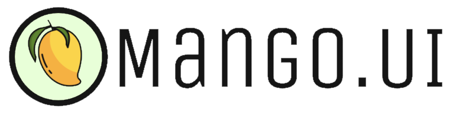
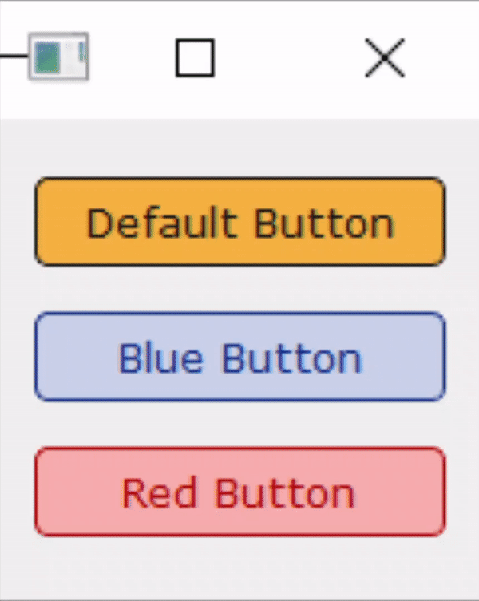
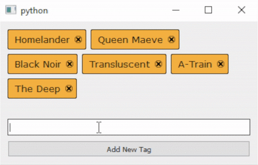

# Overview

**Mango.UI** is a library for **PyQt5** that includes sharper-looking custom-styled widgets for better desktop UI development.

<table>
<tr>
	<td>
        <a href=#button><p align="center"><strong>Button</strong></p></a>
	</td>
	<td>
		<a href=#canvas><p align="center"><strong>Canvas</strong></p></a>
	</td>
</tr>
<tr>
    <td>
    	<p align="center"></p>
    </td>
    <td>
    	<p align="center"></p>
    </td>
</tr>
<tr>
	<td>
		<a href=#slider><p align="center"><strong>Slider</strong></p></a>
	</td>
	<td>
		<a href=#tagbox><p align="center"><strong>TagBox</strong></p></a>
	</td>
</tr>
<tr>
	<td>
		<p align="center"></p>
	</td>
	<td>
        <p align="center"></p>
	</td>
</tr>
</table>


# Installation & Setup

MangoUI is built on top of [PyQt5](https://pypi.org/project/PyQt5/).

Install PyQt5:

```
pip install PyQt5
```

Clone this repository:

```
git clone https://github.com/alvii147/MangoUI.git
```

# Button

See [documentation](docs/Button.md).

## Example Use

```python
import sys
from PyQt5.QtWidgets import QMainWindow, QApplication, QWidget, QVBoxLayout

from MangoUI import Button

class Window(QMainWindow):
    def __init__(self):
        super().__init__()
        self.width = 150
        self.height = 150
        self.xPos = 600
        self.yPos = 400
        self.initUI()

    def initUI(self):
        self.setGeometry(self.xPos, self.yPos, self.width, self.height)
        self.vBoxLayout = QVBoxLayout()
        
        self.button = Button(
            borderWidth = 1,
            borderRadius = 4,
        )
        self.button.setText('Default Button')
        self.vBoxLayout.addWidget(self.button)

        self.blueButton = Button(
            primaryColor  = (17, 46, 133),
            secondaryColor = (202, 209, 232),
            borderWidth = 1,
            borderRadius = 4,
        )
        self.blueButton.setText('Blue Button')
        self.vBoxLayout.addWidget(self.blueButton)

        self.redButton = Button(
            primaryColor  = (171, 3, 3),
            secondaryColor = (247, 173, 173),
            borderWidth = 1,
            borderRadius = 4,
        )
        self.redButton.setText('Red Button')
        self.vBoxLayout.addWidget(self.redButton)

        self.centralWidget = QWidget(self)
        self.centralWidget.setLayout(self.vBoxLayout)
        self.setCentralWidget(self.centralWidget)
        self.show()

if __name__ == '__main__':
    app = QApplication(sys.argv)
    myWin = Window()
    sys.exit(app.exec_())
```


# Canvas

See [documentation](docs/Canvas.md).

## Example Use

```python
import sys
from PyQt5.QtWidgets import QMainWindow, QApplication, QWidget, QVBoxLayout, QLabel
from PyQt5.QtCore import Qt

from MangoUI import Canvas

class Window(QMainWindow):
    def __init__(self):
        super().__init__()
        self.width = 150
        self.height = 150
        self.xPos = 600
        self.yPos = 400
        self.initUI()

    def initUI(self):
        self.setGeometry(self.xPos, self.yPos, self.width, self.height)
        self.vBoxLayout = QVBoxLayout()

        self.canvas = Canvas(
            width = 150,
            height = 150,
            penColor = (21, 21, 21),
            canvasColor = (245, 177, 66),
            strokeWidth = 5,
            borderWidth = 2,
            borderColor = (21, 21, 21)
        )
        self.vBoxLayout.addWidget(self.canvas, alignment = Qt.AlignCenter)

        self.centralWidget = QWidget(self)
        self.centralWidget.setLayout(self.vBoxLayout)
        self.setCentralWidget(self.centralWidget)
        self.show()

if __name__ == '__main__':
    app = QApplication(sys.argv)
    myWin = Window()
    sys.exit(app.exec_())
```


# Slider

See [documentation](docs/Slider.md).

## Example Use

```python
import sys
from PyQt5.QtWidgets import QMainWindow, QApplication, QLabel, QPushButton, QVBoxLayout, QHBoxLayout, QWidget
from PyQt5.QtCore import Qt, QEasingCurve

from MangoUI import Slider

class Window(QMainWindow):
    def __init__(self):
        super().__init__()
        self.width = 500
        self.height = 500
        self.xPos = 600
        self.yPos = 400
        self.initUI()

    def initUI(self):
        self.setGeometry(self.xPos, self.yPos, self.width, self.height)
        self.vBoxLayout = QVBoxLayout()

        self.slider = Slider(
            direction = Qt.Horizontal,
            duration = 750,
            animationType = QEasingCurve.OutQuad,
            wrap = False,
        )

        self.label1 = QLabel()
        self.label1.setText('First Slide')
        self.label1.setAlignment(Qt.AlignCenter)
        self.label1.setStyleSheet('QLabel{background-color: rgb(245, 177, 66); color: rgb(21, 21, 21); font: 25pt;}')
        self.slider.addWidget(self.label1)

        self.label2 = QLabel()
        self.label2.setText('Second Slide')
        self.label2.setAlignment(Qt.AlignCenter)
        self.label2.setStyleSheet('QLabel{background-color: rgb(21, 21, 21); color: rgb(245, 177, 66); font: 25pt;}')
        self.slider.addWidget(self.label2)

        self.label3 = QLabel()
        self.label3.setText('Third Slide')
        self.label3.setAlignment(Qt.AlignCenter)
        self.label3.setStyleSheet('QLabel{background-color: rgb(93, 132, 48); color: rgb(245, 177, 66); font: 25pt;}')
        self.slider.addWidget(self.label3)

        self.buttonPrevious = QPushButton()
        self.buttonPrevious.setText('Previous Slide')
        self.buttonPrevious.clicked.connect(self.slider.slidePrevious)

        self.buttonNext = QPushButton()
        self.buttonNext.setText('Next Slide')
        self.buttonNext.clicked.connect(self.slider.slideNext)

        self.buttonLayout = QHBoxLayout()
        self.buttonLayout.addWidget(self.buttonPrevious)
        self.buttonLayout.addWidget(self.buttonNext)

        self.vBoxLayout.addWidget(self.slider)
        self.vBoxLayout.addLayout(self.buttonLayout)

        self.centralWidget = QWidget(self)
        self.centralWidget.setLayout(self.vBoxLayout)
        self.setCentralWidget(self.centralWidget)

        self.show()

if __name__ == '__main__':
    app = QApplication(sys.argv)
    myWin = Window()
    sys.exit(app.exec_())
```


# TagBox

See [documentation](docs/TagBox.md).

## Example Use

```python
import sys
from PyQt5.QtWidgets import QMainWindow, QApplication, QWidget, QVBoxLayout, QLineEdit, QPushButton

from MangoUI import TagBox

class Window(QMainWindow):
    def __init__(self):
        super().__init__()
        self.width = 450
        self.height = 250
        self.xPos = 600
        self.yPos = 400
        self.initUI()

    def initUI(self):
        self.setGeometry(self.xPos, self.yPos, self.width, self.height)
        self.vBoxLayout = QVBoxLayout()
        
        self.tagbox = TagBox()
        self.tagbox.addTag('Homelander')
        self.tagbox.addTag('Queen Maeve')
        self.tagbox.addTag('Black Noir')
        self.tagbox.addTag('Transluscent')
        self.tagbox.addTag('A-Train')
        self.tagbox.addTag('The Deep')
        self.vBoxLayout.addWidget(self.tagbox)

        self.tagEdit = QLineEdit()
        self.vBoxLayout.addWidget(self.tagEdit)

        self.addButton = QPushButton()
        self.addButton.setText('Add New Tag')
        self.addButton.clicked.connect(self.addNewTag)
        self.vBoxLayout.addWidget(self.addButton)

        self.centralWidget = QWidget(self)
        self.centralWidget.setLayout(self.vBoxLayout)
        self.setCentralWidget(self.centralWidget)
        self.show()

    def addNewTag(self):
        self.tagbox.addTag(self.tagEdit.text())

if __name__ == '__main__':
    app = QApplication(sys.argv)
    myWin = Window()
    sys.exit(app.exec_())
```


