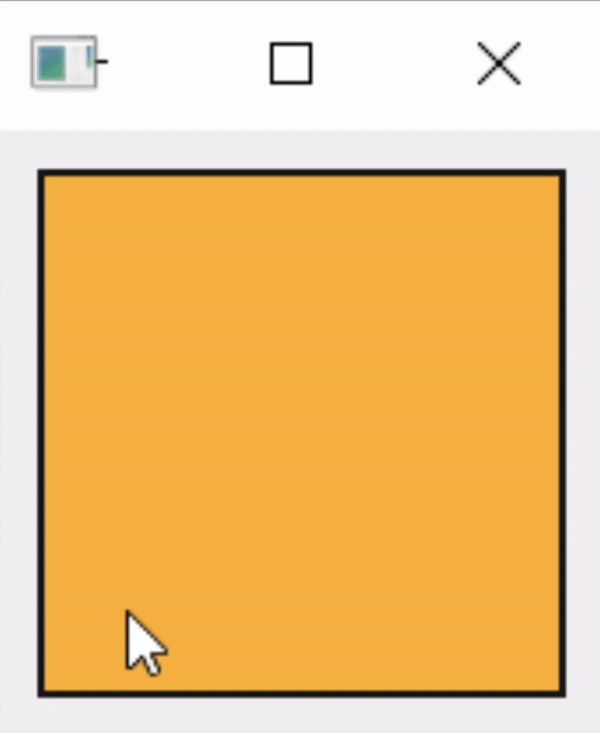

# Canvas

Canvas an inherited class of [QLabel](https://doc.qt.io/qtforpython-5/PySide2/QtWidgets/QLabel.html) with a null [QPixmap](https://doc.qt.io/qtforpython/PySide6/QtGui/QPixmap.html). Using [QPainter](https://doc.qt.io/qtforpython-5/PySide2/QtGui/QPainter.html), Canvas allows the user to draw on the window.



## Constructors & Methods

- [Canvas()](#canvas-1)

- [clearCanvas()](#clearcanvas)

- [saveCanvas()](#savecanvas)

- [setBorder()](#setborder)

- [setPenColor()](#setpencolor)


## `Canvas`()

Create new Canvas object.

```python
Canvas(
    parent=None,
    width=200,
    height=200,
    penColor=(25, 25, 25, 255),
    canvasColor=(255, 247, 242, 255),
    strokeStyle=1,
    strokeWidth=3,
    borderStyle='solid',
    borderColor=(0, 0, 0, 255),
    borderWidth=1,
)
```

### Parameters:

**parent** : *[QWidget](https://doc.qt.io/qtforpython-5/PySide2/QtWidgets/QWidget.html) obj/[QLayout](https://doc.qt.io/qtforpython-5/PySide2/QtWidgets/QLayout.html) obj, optional*
- parent element

**width** : *int, default=200*
- width of canvas

**height** : *int, default=200*
- height of canvas

**penColor** : *[QColor](https://doc.qt.io/qtforpython-5/PySide2/QtGui/QColor.html) obj/RGBA tuple/RGBA 32-bit unsigned int/RGBA str/HEX str, default=(25, 25, 25, 255)*
- pen color

**canvasColor** : *[QColor](https://doc.qt.io/qtforpython-5/PySide2/QtGui/QColor.html) obj/RGBA tuple/RGBA 32-bit unsigned int/RGBA str/HEX str, default=(255, 247, 242, 255)*
- background color of canvas

**strokeStyle** : *QPenStyle obj, default=1*
- line style of pen stroke

**strokeWidth** : *int, default=3*
- width of pen stroke

**borderStyle** : *str, default='solid'*
- border style

**borderColor** : *[QColor](https://doc.qt.io/qtforpython-5/PySide2/QtGui/QColor.html) obj/RGBA tuple/RGBA 32-bit unsigned int/RGBA str/HEX str, default=(0, 0, 0, 255)*
- border color of canvas

**borderWidth** : *int, default=1*
- border width

### Returns:
- *Canvas obj*

## `clearCanvas`()

Clear canvas content.

```python
clearCanvas()
```

### Returns:
- *None*

## `saveCanvas`()

Save canvas content to image file.

```python
saveCanvas(dest)
```

### Parameters:

**dest** : *str*
- image file destination path

### Returns:
- *None*

## `setBorder`()

Set canvas border properties.

```python
setBorder(
    borderStyle=None,
    borderColor=None,
    borderWidth=None,
)
```

### Parameters:

**borderStyle** : *str, optional*
- border style

**borderColor** : *[QColor](https://doc.qt.io/qtforpython-5/PySide2/QtGui/QColor.html) obj/RGBA tuple/RGBA 32-bit unsigned int/RGBA str/HEX str, optional*
- border color of canvas

**borderWidth** : *int, optional*
- border width

### Returns:
- *None*

## `setPenColor`()

Set pen color.

```python
setPenColor(color)
```

### Parameters:

**color** : *[QColor](https://doc.qt.io/qtforpython-5/PySide2/QtGui/QColor.html) obj/RGBA tuple/RGBA 32-bit unsigned int/RGBA str/HEX str*
- pen color

### Returns:
- *None*

