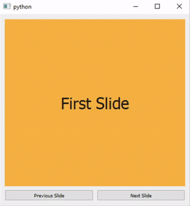

# Slider

Slider an inherited class of [QStackedWidget](https://doc.qt.io/archives/qtforpython-5.12/PySide2/QtWidgets/QStackedWidget.html) that supports slide navigation between stacked widgets.



## Constructors & Methods

- [Slider()](#slider-1)

- [setAnimationType()](#setanimationtype)

- [setDirection()](#setdirection)

- [setDuration()](#setduration)

- [setWrap()](#setwrap)

- [slideIndex()](#slideindex)

- [slideNext()](#slidenext)

- [slidePrevious()](#slideprevious)


## `Slider`()

Create new Slider object.

```python
Slider(
    parent=None,
    direction=1,
    duration=500,
    animationType=6,
    wrap=False,
)
```

### Parameters:

**parent** : *[QWidget](https://doc.qt.io/qtforpython-5/PySide2/QtWidgets/QWidget.html) obj/[QLayout](https://doc.qt.io/qtforpython-5/PySide2/QtWidgets/QLayout.html) obj, optional*
- Parent element

**direction** : *[Qt.Orientation](https://doc.qt.io/qtforpython/PySide6/QtCore/Qt.html#PySide6.QtCore.PySide6.QtCore.Qt.Orientation) obj, default=1*
- direction of animation

**duration** : *int, default=500*
- animation during in milliseconds

**animationType** : *[QEasingCurve.Type](https://doc.qt.io/qtforpython/PySide6/QtCore/QEasingCurve.html#PySide6.QtCore.PySide6.QtCore.QEasingCurve.Type) obj, default=6*
- animation type

**wrap** : *bool, default=False*
- wrap around slides

### Returns:
- *Slider obj*

## `setAnimationType`()

Set animation type.

```python
setAnimationType(animationType)
```

### Parameters:

**animationType** : *[QEasingCurve.Type](https://doc.qt.io/qtforpython/PySide6/QtCore/QEasingCurve.html#PySide6.QtCore.PySide6.QtCore.QEasingCurve.Type) obj*
- animation type

### Returns:
- *None*

## `setDirection`()

Set direction of animation.

```python
setDirection(direction)
```

### Parameters:

**direction** : *[Qt.Orientation](https://doc.qt.io/qtforpython/PySide6/QtCore/Qt.html#PySide6.QtCore.PySide6.QtCore.Qt.Orientation) obj*
- direction of animation

### Returns:
- *None*

## `setDuration`()

Set animation duration.

```python
setDuration(duration)
```

### Parameters:

**duration** : *int*
- animation during in milliseconds

### Returns:
- *None*

## `setWrap`()

Set animation duration.

```python
setWrap(wrap)
```

### Parameters:

**wrap** : *bool*
- wrap around slides

### Returns:
- *None*

## `slideIndex`()

Move to slide by index.

```python
slideIndex(index)
```

### Parameters:

**index** : *int*
- index position of slide

### Returns:
- *None*

## `slideNext`()

Move to next slide.

```python
slideNext()
```

### Returns:
- *None*

## `slidePrevious`()

Move to previous slide.

```python
slidePrevious()
```

### Returns:
- *None*

