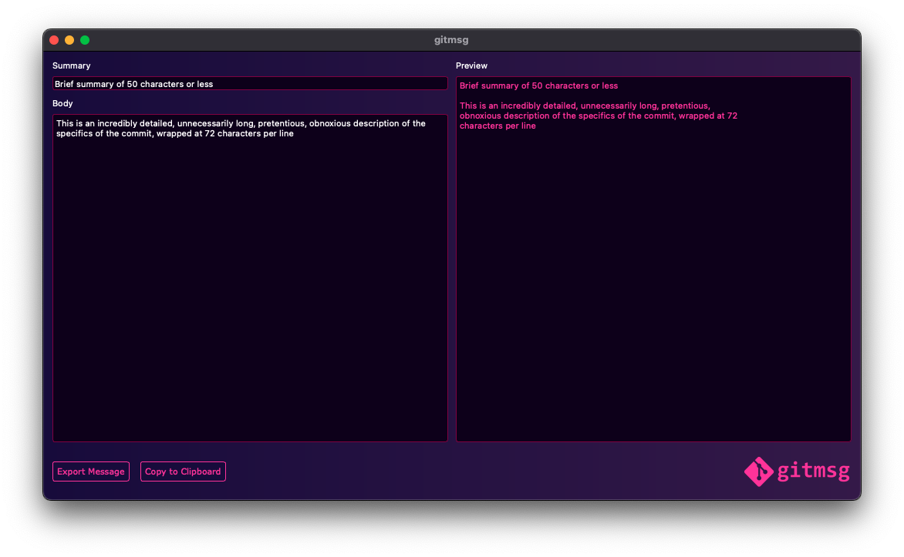

<p align="center">
    
</p>

<p align="center">

**_gitmsg_** is an application for writing git commit messages according to the [git 50/72 rule](https://www.midori-global.com/blog/2018/04/02/git-50-72-rule).

</p>

<div align="center">

[](https://github.com/alvii147/gitmsg/actions) [](https://goreportcard.com/report/github.com/alvii147/gitmsg/cli)

</div>

## Installation

Clone the repository:

```bash
git clone https://github.com/alvii147/gitmsg.git
```

Setup *gitmsg*:

```bash
cd gitmsg/
./setup.sh
```

Set up alias to script by adding the following to `~/.bashrc` or `~/.bash_profile`:

```bash
alias gitmsg="/absolute/path/to/gitmsg/gitmsg.sh"
```

## Usage

```
gitmsg helps write git commit messages based on the git 50/72 rule.

Usage:
        gitmsg [OPTIONS]

Options:
        -g, run in GUI mode
        -c, run in CLI mode
        -h, show help
```

### GUI Mode

```bash
gitmsg -g
```



### CLI mode

```bash
gitmsg -c
```


